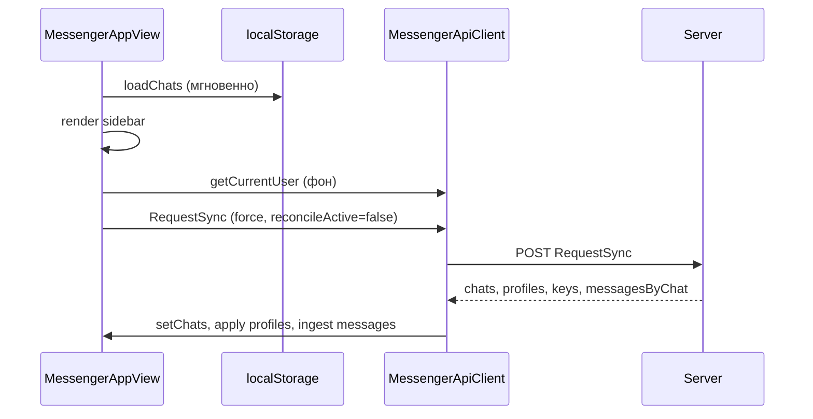
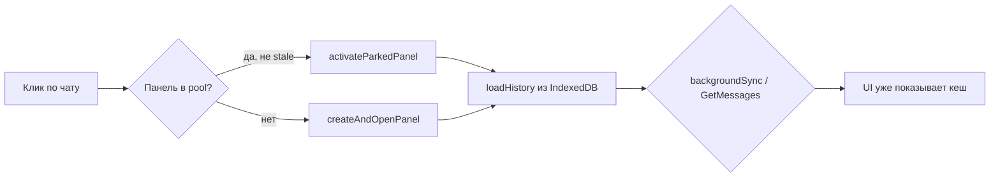

# Сетевая логика и синхронизация данных

Документ описывает, как клиент и сервер обмениваются данными после оптимизации сетевого слоя (v1.1.107+): единый бандл `RequestSync`, кеш-first UI, SignalR для дельт, точечные HTTP-запросы только для мутаций и on-demand сценариев.

Связанные документы: [02-architecture.md](02-architecture.md), [03-api-reference.md](03-api-reference.md), [04-frontend-reference.md](04-frontend-reference.md), [05-encryption.md](05-encryption.md).

---

## Принципы

| Принцип | Реализация |
|---------|------------|
| **Кеш-first UI** | Список чатов и сообщения сначала из localStorage / IndexedDB; сеть не блокирует переключение чатов |
| **Один бандл вместо N запросов** | `RequestSync` при загрузке, reconnect и по подсказке `SupraSyncHint` |
| **Дельты по WebSocket** | Новые сообщения, статусы, профили, presence — через SignalR без polling |
| **HTTP для мутаций** | Отправка, редактирование, удаление, загрузка файлов, настройки |
| **On-demand HTTP** | Профиль при открытии модалки (если нет в кеше), старые сообщения при скролле вверх |
| **Без лишних запросов в hot path** | Открытие чата не вызывает `GetChats`, `GET /api/profile/{id}`, `MarkMessagesRead` без непрочитанных |

---

## Общая схема

```mermaid
flowchart TB
    subgraph Client["Браузер"]
        UI[MessengerAppView / ChatPanel]
        LS[MessengerOfflineStore<br/>localStorage: список чатов]
        IDB[MessengerCache<br/>IndexedDB: сообщения]
        API[MessengerApiClient]
        TR[MessengerTransport<br/>SignalR]
        SYNC[requestSyncBundle]
    end

    subgraph Server["SuperMessenger.Web"]
        RPC[POST /api/messenger/{method}]
        HUB[MessengerHub /hubs/messenger]
        SYNC_SVC[MessengerSyncService]
        MSG_SVC[SupraMessengerService]
        RT[RealtimeNotifier]
    end

    UI --> LS
    UI --> IDB
    UI --> SYNC
    SYNC --> API
    API --> RPC
    TR --> HUB
    HUB --> RT
    RT --> TR
    RPC --> SYNC_SVC
    SYNC_SVC --> MSG_SVC
```

### Два канала данных

1. **Синхронизация (bulk)** — `POST /api/messenger/RequestSync`: список чатов, догоняющие сообщения, профили контактов, ключи шифрования.
2. **Realtime (incremental)** — SignalR событие `message` с телом `SupraWs*Payload`: новые сообщения, обновления профиля, presence и т.д.

Мутации (отправка сообщения и др.) идут через RPC и **дополнительно** рассылаются участникам по SignalR с сервера.

---

## RequestSync — центральный бандл

### Endpoint

```
POST /api/messenger/RequestSync
Authorization: cookie
Content-Type: application/json
```

Ответ в стандартном формате RPC: `{ "RequestSyncResult": "{ ...json... }" }`.

### Запрос (`SupraRequestSyncRequest`)

| Поле | Тип | По умолчанию | Описание |
|------|-----|--------------|----------|
| `chatCursors` | `Record<chatId, messageId \| null>` | `{}` | Последний известный клиенту `messageId` по каждому чату (из IndexedDB `chatMeta.lastId`) |
| `includeProfiles` | `bool` | `true` | Публичные профили всех direct-контактов из списка чатов |
| `includeEncryptionKeys` | `bool` | `true` | Обёрнутые автоключи (`wrappedAutoPassword`) для текущего пользователя по каждому чату |
| `messageLimit` | `int` | `50` | Макс. новых сообщений на чат (1–100) |

**Важно:** сообщения в бандле возвращаются **только** для чатов, у которых в `chatCursors` передан непустой `messageId`. Чаты без курсора получают только метаданные в `chats[]` — история подгружается при открытии чата из кеша или через `GetMessages`.

Пример тела:

```json
{
  "chatCursors": {
    "a1b2c3d4-....": "f9e8d7c6-....",
    "b2c3d4e5-....": "12345678-...."
  },
  "includeProfiles": true,
  "includeEncryptionKeys": true,
  "messageLimit": 50
}
```

### Ответ (`SupraRequestSyncResponse`)

| Поле | Описание |
|------|----------|
| `success` | Успех операции |
| `chats` | Полный список чатов пользователя (аналог `GetChats`, но с оптимизированной сборкой на сервере) |
| `messagesByChat` | `chatId → messages[]` — только **новые** сообщения после курсора |
| `profiles` | `userId → SupraPublicProfileDto` — direct-контакты |
| `encryptionKeys` | `chatId → { found, wrappedAutoPassword? }` |
| `error` | Текст ошибки при `success: false` |

### Серверная реализация

| Компонент | Файл | Роль |
|-----------|------|------|
| `SupraMessengerService.BuildChatListSnapshotAsync` | `Infrastructure/Services/SupraMessengerService.Sync.cs` | Одно чтение `messages.json`, `participants.json`, `chat-member-keys.json`; сборка `SupraChatDto[]` |
| `SupraMessengerService.RequestSyncAsync` | там же | Срезы сообщений после курсора, делегирование профилей и ключей |
| `MessengerSyncService` | `Web/Services/MessengerSyncService.cs` | Профили (`BuildPublicProfileAsync`) и ключи (`SupraEncryptionService`) |
| `SupraMessengerController.HandleRequestSync` | `Web/Controllers/SupraMessengerController.cs` | HTTP-вход |

`GetChats` использует тот же оптимизированный `BuildChatListSnapshotAsync` (без сообщений/профилей/ключей) — оставлен для fallback и модалок (пересылка и т.п.).

### Оптимизация GetChats на сервере

**До:** для каждого чата отдельно читался весь `messages.json` (N полных чтений файла).

**После:** одно чтение через `IDataStore.GetAllMessagesAsync()`, группировка по `ChatId` в памяти. Аналогично — `GetAllParticipantsAsync()`, `GetAllChatMemberKeysAsync()`.

---

## SignalR: SupraSyncHint и realtime-события

### Подключение

```
GET/WS  /hubs/messenger
Auth:   cookie (SignalR withCredentials)
```

При `OnConnectedAsync` (`MessengerHub`):

1. Пользователь добавляется в группу `user:{userId}`.
2. Обновляется presence (`UserPresenceService`, `UserPresenceNotifier`).
3. Доставляются отложенные смены логина (`UserLoginChangeService`).
4. Отправляется **`SupraSyncHint`** — подсказка клиенту запустить `RequestSync`.

```json
{
  "Header": { "BodyTypeName": "SupraMessenger", "Sender": "SupraMessenger" },
  "Body": { "type": "SupraSyncHint", "reason": "connected" }
}
```

Клиент (`Messenger.#onTransportMessage`, case `SupraSyncHint`) вызывает `MessengerAppView.requestSyncBundle()` — с дебаунсом 2.5 с, чтобы не дублировать boot-sync.

### События без chatId

`MessengerTransport.#dispatch` пропускает в обработчик тела **без** `chatId` только для типов:

- `SupraPresenceUpdate`
- `SupraChatHistoryCleared`
- `SupraProfileUpdated`
- `SupraAppearanceUpdated`
- `SupraLoginChanged`
- **`SupraSyncHint`**

### Полная таблица WS-payload

| type | Когда | Действие клиента |
|------|-------|------------------|
| `SupraNewChatMessage` | Отправка сообщения | `receiveMessage`, обновление превью |
| `SupraMessageStatusUpdate` | Прочтение на другом устройстве | `updateMessageStatus` |
| `SupraChatRead` | Mark read текущим пользователем | Сброс unread на всех вкладках |
| `SupraNewChat` | Создание чата | `addChat` |
| `SupraUserActivity` | Печатает / запись | `receiveActivity` |
| `SupraChatHistoryCleared` | Очистка истории | `handleHistoryCleared`, сброс кеша |
| `SupraPresenceUpdate` | online / idle / offline | `MessengerPresenceManager.update` |
| `SupraProfileUpdated` | Изменение профиля | Кеш + `updateContactProfile` / `setCurrentUser` |
| `SupraGroupUpdated` | Изменение группы | `updateChatMeta` |
| `SupraChatRemoved` | Выход / блокировка | `removeChat` |
| `SupraAppearanceUpdated` | Смена темы в админке | `AppBranding.reloadAppearance` |
| `SupraLoginChanged` | Смена логина контакта | Уведомление |
| `SupraSyncHint` | Подключение к hub | `requestSyncBundle` |
| `SupraDeleteMessage` / `SupraMessageUpdated` | Удаление / редактирование | Обновление панели и превью |

**Профили:** после синхронизации профили приходят в бандле; дальнейшие изменения — только через `SupraProfileUpdated`. `GET /api/profile/{userId}` вызывается лишь при открытии модалки профиля, если записи нет в `#profileCache`.

---

## Клиент: слои кеша

| Слой | Класс / хранилище | Содержимое | Когда читается |
|------|-------------------|------------|----------------|
| Список чатов | `MessengerOfflineStore` (localStorage) | `chats[]`, `savedAt` | Мгновенный старт UI до `RequestSync` |
| Сообщения | `MessengerCache` (IndexedDB `MessengerCacheDB`) | Сообщения, `chatMeta.lastId/lastTs` | Открытие чата, превью в sidebar |
| Мета чатов (шифрование) | `MessengerApiClient.#chatsMeta` | `Map<chatId, dto>` | Расшифровка, `ensureChatEncryptionKeys` |
| Профили контактов | `MessengerApiClient.#profileCache` | `Map<userId, profile>` | Шапка чата, модалка профиля |
| Ключи из sync | `MessengerApiClient.#syncWrappedKeys` | `Map<chatId, wrappedAutoPassword>` | Расшифровка без `GET /api/encryption/group-keys` |
| Статус ключей | `MessengerApiClient.#chatKeyStatus` | `{ hasKey, checkedAt }` | Пропуск повторных запросов ключей |

### Курсоры для RequestSync

`MessengerAppView.#buildSyncCursors()`:

1. Для каждого чата из `#chats` вызывает `MessengerMessageService.getLastCachedMessageId(chatId)`.
2. Читает `MessengerCache.getChatMeta(chatId).lastId`.
3. Чаты без сообщений в IndexedDB не попадают в `messagesByChat` ответа.

---

## Жизненный цикл синхронизации

### 1. Загрузка приложения (`Messenger.#initApp`)



Порядок:

1. `render` — shell UI.
2. Пользователь из `__smBootUser` / `MessengerOfflineStore.loadUser`.
3. Кешированные чаты из localStorage → `setChats` (мгновенный sidebar).
4. Параллельно: `loadFolders`, `reconcileOnStartup` (зависшие `sending`).
5. `requestSyncBundle({ force: true, reconcileActive: false })` — один HTTP-запрос вместо `GetChats` + N×`GetMessages`.
6. При ошибке `RequestSync` → fallback `GetChats`.

### 2. Переподключение SignalR

Триггеры:

- `MessengerTransport.#markConnected` при **повторном** connect (`#hadConnectedOnce === true`) → `#syncAfterReconnect`.
- `SupraSyncHint` при новом connect (дебаунс с boot).

`syncAfterReconnect` → `requestSyncBundle` (полный бандл + reconcile активного чата).

### 3. `requestSyncBundle` — применение бандла

`MessengerAppView.#applySyncBundle`:

| Шаг | Блокирует UI? | Описание |
|-----|---------------|----------|
| `setChats(result.chats)` | Нет | Sidebar, localStorage, `scheduleRefreshLastMessagePreviews` (idle) |
| `#applyProfilesFromSync` | Нет | Кеш, presence, `updateContactProfile` |
| `importSyncEncryptionKeys` | Нет | `#syncWrappedKeys`, `#chatKeyStatus` |
| `ingest` + `receiveMessage` по чатам | Нет | Параллельно через `Promise.all` |
| `syncNewMessages` активного чата | Только фон | Reconcile удалений для **открытого** чата |
| `syncPanelMessages` + decrypt | Если чат виден | Догон UI панели |

**Дебаунс:** повторный вызов в течение 2.5 с игнорируется (кроме `force: true` при boot).

**In-flight:** одновременно выполняется не более одного `requestSyncBundle` (`#syncInFlight`).

---

## Открытие чата (hot path)



### Что происходит при `#openChat`

| Действие | Сеть |
|----------|------|
| `recordEngagement` | — |
| `ensureChatKeysInBackground` | HTTP **только** если ключ ещё не в `#chatKeyStatus` / `#syncWrappedKeys` |
| Сброс unread в UI | — |
| `markReadIfEngaged` | `MarkMessagesRead` **только** если был `#pendingMarkRead` (были непрочитанные) |
| Активация / создание панели | — |
| `loadHistory` | IndexedDB; `GetMessages` только если кеш пуст (`#fetchInitialFromServer`) |
| `#prefetchDirectContactPresence` | **Убрано** — статус из `chat.contactStatusText` + presence + sync-профили |

### Уход из чата (`#parkActivePanel`)

| Действие | Сеть |
|----------|------|
| `refreshChatListPreview` | **Только локальный кеш** сообщений; без `GetChats` |
| `relockProtectedMessages` | — (локальная расшифровка в locked-состояние) |

### Превью в sidebar без «замочков»

`decryptChatListPreviews`:

- Расшифровка в `requestIdleCallback`, не блокирует переключение чатов.
- Если расшифровка вернула `LOCKED_PREVIEW`, а предыдущий текст был читаемым — **превью не затирается**.
- `refreshChatListPreview` не вызывает `getChats()` при отсутствии данных в кеше.

---

## MarkMessagesRead

### Сервер

`POST /api/messenger/MarkMessagesRead` → `SupraMessengerService.MarkMessagesReadAsync`:

- Ставит `status = "read"` всем чужим сообщениям в чате.
- Рассылает `SupraWsStatusPayload` отправителям и `SupraWsChatReadPayload` текущему пользователю.

### Клиент

`MessengerChatReadGate` — не слать «прочитано», если пользователь не взаимодействовал с панелью > 5 мин или вкладка скрыта.

`markReadIfEngaged(chatId, { becauseNewMessage })`:

1. Проверка `#pendingMarkRead.has(chatId)` **или** `chat.unreadCount > 0` **или** `becauseNewMessage` (входящее сообщение при открытом чате).
2. Проверка `readGate.shouldMarkRead`.
3. `api.markRead(chatId)` → при успехе удаление из `#pendingMarkRead`.

При `RequestSync` / `setChats`: если чат сейчас открыт и виден, а сервер вернул `unreadCount > 0`, клиент снова ставит `#pendingMarkRead` и обнуляет badge — затем отправляет прочтение (возврат в приложение с открытым чатом).

При открытии чата с непрочитанными: UI сразу обнуляет badge, `chatId` добавляется в `#pendingMarkRead`, затем при engagement уходит один `MarkMessagesRead`.

---

## Сообщения: когда вызывается GetMessages

| Сценарий | Источник данных |
|----------|-----------------|
| Первое открытие чата (есть кеш) | IndexedDB → `#panelInitialLoad` → фоновый `#backgroundSyncPanelMessages` |
| Первое открытие (кеш пуст) | `GetMessages(chatId, offset=0, count=50)` |
| Скролл вверх | `GetMessages` / кеш старших страниц |
| Reconnect / RequestSync | `messagesByChat` по курсорам + `syncNewMessages` для активного чата |
| Новое сообщение по WS | `receiveMessage` без HTTP |
| Цитата / jump to message | `GetMessagesAround` |
| Reconcile удалений | `GetMessageSyncIndex` (при открытом чате на reconnect) |
| Зависшие отправки (startup) | `reconcileOnStartup` → `getNewMessages` по тексту |

`GetMessages` с `afterMessageId` — инкрементальная догрузка (используется в `syncNewMessages`).

---

## Профили контактов

### Источники данных (по приоритету)

1. **RequestSync** → `profiles` в бандле → `#profileCache` + `updateContactProfile`.
2. **SupraProfileUpdated** (WS) → обновление кеша и UI.
3. **Поля в `SupraChatDto`** — `contactStatusText`, `contactLastSeenAt` (из списка чатов).
4. **GET `/api/profile/{userId}`** — только при `showContactProfile` / `getContactByLogin`, если нет в `#profileCache`.

`GET /api/profile/{userId}` **не вызывается** при каждом открытии direct-чата.

### Поля `SupraPublicProfileDto`

`id`, `login`, `displayName`, `avatar`, `statusText`, `aboutText`, `lastSeenAt`, `onlineStatus`, `canWrite`.

---

## Ключи шифрования (E2EE)

### В бандле

`encryptionKeys[chatId] = { found, wrappedAutoPassword? }` — те же данные, что `GET /api/encryption/group-keys/{chatId}`.

Клиент: `importSyncEncryptionKeys` → `#syncWrappedKeys`; при расшифровке `MessengerApiClient.#cryptoFetchOpts(chatId)` отдаёт ключ из sync без HTTP.

### Отдельные запросы (когда всё ещё нужны)

| Endpoint | Когда |
|----------|-------|
| `GET /api/encryption/group-keys/{chatId}` | Нет ключа в sync, первое шифрование чата |
| `GET .../missing` | `ensureChatEncryptionKeys` — выдача ключа новому участнику |
| `POST /api/encryption/group-keys` | Создание / ротация ключей при отправке |
| `POST /api/encryption/public-keys` | Обёртка для участников |

Подробнее: [05-encryption.md](05-encryption.md).

---

## Полный каталог HTTP-запросов мессенджера

### Синхронизация (редко, бандл)

| Метод RPC | Частота |
|-----------|---------|
| **RequestSync** | Boot, reconnect, SupraSyncHint (с дебаунсом) |
| GetChats | Fallback, модалка пересылки, ручной reload при ошибке sync |
| GetCurrentUser | Boot (уточнение профиля) |

### По действию пользователя (on-demand)

| Метод RPC / HTTP | Триггер |
|------------------|---------|
| GetMessages | Пустой кеш, скролл, reconcile |
| GetMessagesAround | Переход к цитате |
| GetMessageSyncIndex | Reconcile удалённых (активный чат) |
| MarkMessagesRead | Открытие чата **с непрочитанными** + engagement |
| SendMessage / EditMessage / DeleteMessage | Отправка / редактирование |
| GetFolders / SaveFolder / … | Папки |
| GetGroupInfo / UpdateGroup / … | Профиль группы |
| GET /api/profile/{id} | Модалка профиля без кеша |
| GET/POST /api/encryption/* | Мастер-пароль, ключи (см. выше) |
| POST /api/files/upload | Вложения |

### Не вызываются в hot path открытия чата

- ~~GetChats при park~~
- ~~GET profile при каждом openChat~~
- ~~MarkMessagesRead без непрочитанных~~
- ~~N× GetMessages на reconnect~~ (заменено RequestSync)

---

## Fallback и устойчивость

| Ситуация | Поведение |
|----------|-----------|
| `RequestSync` failed на boot | `GetChats` + кеш localStorage |
| `RequestSync` failed на reconnect | Лог warning; UI на кеше; WS продолжает работать |
| Нет SignalR | `MessengerTransport` — WebSocket fallback или offline |
| Смена BPMCSRF токена | `resetAll` кеша сообщений, `reloadAllChats` → `RequestSync` |
| Офлайн отправка | `reconcileOnStartup` ищет сообщение на сервере по тексту |

---

## Файлы реализации

### Сервер

| Файл | Содержание |
|------|------------|
| `Core/Dtos/SupraMessengerDtos.cs` | `SupraRequestSync*`, `SupraPublicProfileDto`, `SupraWsSyncHintPayload` |
| `Core/Abstractions/IDataStore.cs` | `GetAllMessagesAsync`, `GetAllParticipantsAsync`, `GetAllChatMemberKeysAsync` |
| `Infrastructure/Services/SupraMessengerService.Sync.cs` | Snapshot чатов, `RequestSyncAsync` |
| `Web/Services/MessengerSyncService.cs` | Оркестрация профилей и ключей |
| `Web/Controllers/SupraMessengerController.cs` | `RequestSync` case |
| `Web/Hubs/MessengerHub.cs` | `SupraSyncHint` on connect |

### Клиент (`supra-messenger.js`)

| Класс / метод | Содержание |
|---------------|------------|
| `MessengerApiClient.requestSync` | HTTP вызов бандла |
| `MessengerApiClient.importSyncEncryptionKeys` | Ключи из бандла |
| `MessengerApiClient.#profileCache` | Кеш профилей |
| `MessengerApiClient.#cryptoFetchOpts` | Ключ из sync vs fetch |
| `MessengerAppView.requestSyncBundle` | Оркестрация sync |
| `MessengerAppView.#applySyncBundle` | Применение ответа |
| `MessengerAppView.markReadIfEngaged` | Условный MarkMessagesRead |
| `MessengerAppView.refreshChatListPreview` | Только локальный кеш |
| `Messenger.#loadBootChats` | Boot через RequestSync |
| `MessengerTransport.#dispatch` | `SupraSyncHint` |

---

## Диаграмма: было → стало (reconnect)

**Было (N+1 запросов):**

```
GetChats
  → для каждого чата: GetMessages + GetMessageSyncIndex
  → refreshChatListPreview → GetChats снова
  → prefetchAllDirectContactPresence → GET profile × M
```

**Стало:**

```
RequestSync (1 HTTP)
  → chats + messagesByChat + profiles + encryptionKeys
  → reconcile только активного чата
  → превью из IndexedDB
```

---

## Расширение

1. **Новое поле в бандле** — DTO в `SupraRequestSyncResponse`, сборка в `RequestSyncAsync`, применение в `#applySyncBundle`.
2. **Per-user unread cursor** — потребует `ChatListMeta` на сервере (сейчас unread по глобальному `message.Status`).
3. **Chunked WS bundle** — при очень больших аккаунтах можно слать секции через `RealtimeNotifier` вместо одного HTTP JSON.
